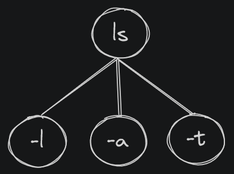
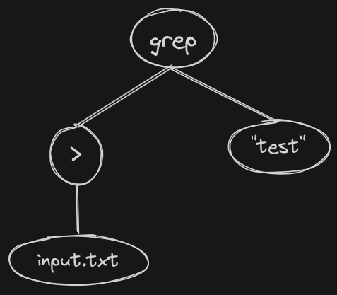
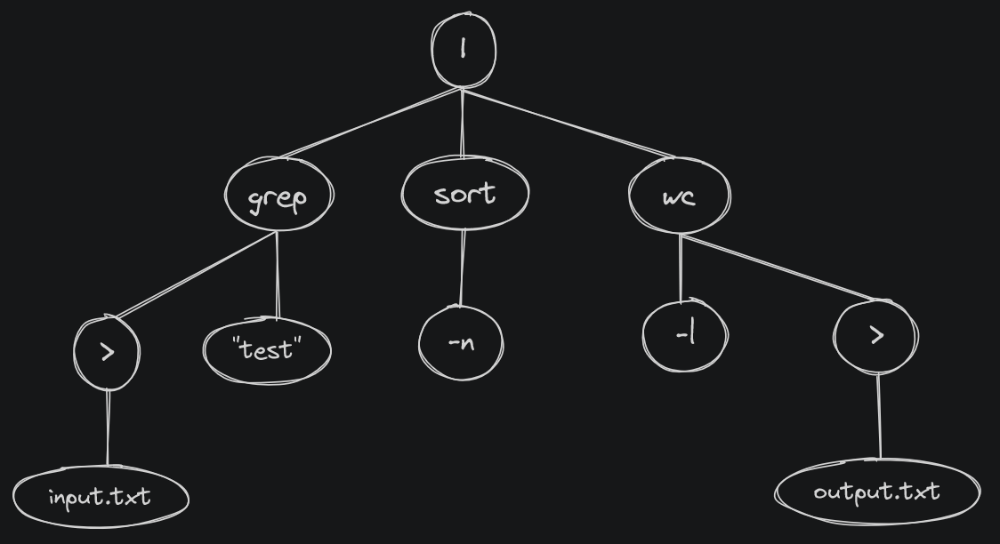

# Parser

Durant l'étape du `parser`, la liste de token est tranformé en un arbre syntaxique. Cette arbre représente les relations entre les différent éléments de la commande entré par l'utilisateur. Nous allons, durant la suite de l'exécution du programme, pouvoir intérpretter les commandes, savoir se qu'il faut exécuter en premier, savoir ou il faut rediriger l'entrée et la sortie standard de chaque sous processus (execution de une seule fonction), etc.

Le parser utilise le type `t_dyntree` afin de représenter l'arbre. Ce type est un arbre dynamic, c'est à dire qu 'il peu avoir un nombre infini d'enfants et que lros de l'ajout d'un enfant, la mémoire est automatiquement étendue pour pouvoir l'aceuillir.

## Exemple d'arbre syntaxique

### Arbre simple

Voici comment est représenté un arbre au sain d'une structure `t_dyntree`

```bash
ls -l -a -t
```



Cette représentation est une représentation logique d'un arbre. En réalité, chaque noeud de l'arbre comporte les mêmes informations qu'un token, donc un `type` et une `value`.

```c
int	main(void)
{
	t_dyntree *root;

	root = NULL;
	root = dyntree_new(TK_COMMAND, "ls");
	dyntree_add(root, dyntree_new(TK_ARGUMENT, "-l"));
	dyntree_add(root, dyntree_new(TK_ARGUMENT, "-a"));
	dyntree_add(root, dyntree_new(TK_ARGUMENT, "-t"));
	db_show_tree(root, 0);
	dyntree_free(root);
	return (0);
}
```

```text
node->type : TK_COMMAND | node->value : "ls" | 3/4
  node->type : TK_ARGUMENT | node->value : "-l" | 0/2
  node->type : TK_ARGUMENT | node->value : "-a" | 0/2
  node->type : TK_ARGUMENT | node->value : "-t" | 0/2
```

### Arbre avec redirection

Voici comment se représenter un arbre qui contient une redirection et un argument.


```bash
input.txt > grep "test"
```



```c
int	main(void)
{
	t_dyntree *root;

	root = NULL;
	root = dyntree_new(TK_COMMAND, "grep");
	dyntree_add(root, dyntree_new(TK_ARGUMENT, ">"));
	dyntree_add(root->children[0], dyntree_new(TK_FILE, "input.txt"));
	dyntree_add(root, dyntree_new(TK_ARGUMENT, "test"));
	db_show_tree(root, 0);
	dyntree_free(root);
	return (0);
}
```

```text
node->type : TK_COMMAND | node->value : "grep" | 2/2
  node->type : TK_ARGUMENT | node->value : ">" | 1/2
    node->type : TK_FILE | node->value : "input.txt" | 0/2
  node->type : TK_ARGUMENT | node->value : "test" | 0/2
```

### Arbre avec pipe

Ceci est la représentation d'un arbre de 3 commandes qui communique via un pipe.

```bash
input.txt > grep "test" | sort -n | wc -l > output.txt
```



```c
int	main(void)
{
	t_dyntree *root;

	root = NULL;
	root = dyntree_new(TK_PIPE, "|");

	dyntree_add(root, dyntree_new(TK_COMMAND, "grep"));
	dyntree_add(root, dyntree_new(TK_COMMAND, "sort"));
	dyntree_add(root, dyntree_new(TK_COMMAND, "wc"));

	dyntree_add(root->children[0], dyntree_new(TK_REDIRECTION, "<"));
	dyntree_add(root->children[0]->children[0], dyntree_new(TK_REDIRECTION, "input.txt"));
	dyntree_add(root->children[0], dyntree_new(TK_ARGUMENT, "test"));

	dyntree_add(root->children[1], dyntree_new(TK_ARGUMENT, "-n"));

	dyntree_add(root->children[2], dyntree_new(TK_ARGUMENT "-l"));
	dyntree_add(root->children[2], dyntree_new(TK_REDIRECTION, ">"));
	dyntree_add(root->children[2]->children[1], dyntree_new(TK_FILE, "output.txt"));

	db_show_tree(root, 0);
	dyntree_free(root);
	return (0);
}
```

```text
node->type : TK_PIPE | node->value : "|" | 3
  node->type : TK_COMMAND | node->value : "grep" | 2/2
    node->type : TK_REDIRECTION | node->value : "<" | 1/2
      node->type : TK_REDIRECTION | node->value : "input.txt" | 0/2
    node->type : TK_ARGUMENT | node->value : "test" | 0/2
  node->type : TK_COMMAND | node->value : "sort" | 1/2
    node->type : TK_ARGUMENT | node->value : "-n" | 0/2
  node->type : TK_COMMAND | node->value : "wc" | 2/2
    node->type : TK_ARGUMENT | node->value : "-l" | 0/2
    node->type : TK_REDIRECTION | node->value : ">" | 1/2
      node->type : TK_FILE | node->value : "output.txt" | 0/2
```

## Dyntree

Le type `t_dyntree` est un arbre dynamique qui se charge automatiquement de demander plus de mémoire lors de l'ajout d'un fils dans un arbre.

Le type `t_dyntree` est définit comme suite dans le fichier `dytree.h`

```c
typedef struct s_dyntree
{
	int					type;
	char				*value;
	struct s_dyntree	**children;
	size_t				numChildren;
	size_t				capacity;
}	t_dyntree;
```

Comme pour un token, il comporte une `type` et une `value`. L'entrée `children` de type `t_dyntree **` est un pointeur vers un table de `t_dyntree` ou chaque `t_dyntree` est un enfant du node. en plus de cela, la structure comporte deux champs sumplémentaire : `numChildren` et `capacity`. Ces desx valeur peuvent parraitre très semblable alors qu'elles ont une utilisations bien différente. `numChildren` correspond au nombre d'enfants effectif qu'a le noeud alors que `capacity` est le nombre d'enfant que nous pouvons actuellement mettre dans le tableau. `numChildren` est très utile à l'utilisateur alors que `capacity` sert pour la réatribution automatique de mémoire supplémentaire lors de l'ajout d'un enfant.

### Stratégie d'allocation mémoire

Afin de pouvoir gérer la taille de l'arbre automatiquement, justilise la fonction `ft_realloc()` que j'ai fait moi même. Elle fonction pratiquement de la même manière, sauf qu'elle demande en plus d'un pointeur vers la zone mémoire et la nouvelle taille, la taille actuelle.

Comme pour la fonction `realloc()`, chaque appel à la fonction `ft_realloc()` est couteux, et un arbre peu devenir très vite massif (une noeud root peut avoir n enfants, qui peuvent avoir n enfant, qui peuventl...). Il faut donc limité un maximum les appels à la fonction. C'est pourquoi, j'ai choisi de définir une stratégie d'allocation de la mémoire, plutôt que de faire appel a `ft_realloc` chaque fois que je veux créer un enfant.

La stratégie est simple, lors de l'appel à la fonction `dyntree_new()`, un arbre est créer avec un tableau `children` avec deux place initiale. La valeur `t_dyntree->capacity` est donc de 2 alors que le `numChildren` est à 0.

Dorénavant, chaque fois que nous allons utiliser la fonction `dyntree_add()` sur cette abre, la fonction va commencer par regarder le `numChildren` ainsi que la `capacity`. Si il n'y a plus de place pour ajouter le nouvel enfant, la fonction va faire appel à `ft_realloc()` afin de demander la place pour `actual_capacity * 2`. Cela réduit énormément le nombre d'appel à la fonction `ft_realloc()`. Par contre, il se peut que de la place soit allouer pour rien. Par exemple, si nous voulons stocker `9` enfants dans notre arbre, la taille du tableau `children` sera de `16`. Je pense que cette approche est un bon ratio entre le nombre d'appel à la fonction et le nombre de place demandée inutilisée.

### dyntree_new()

```c
t_dyntree	*dyntree_new(int type, char *value);
```

La fonction `dyntree_new()` permet de créer un nouvel arbre, d'allouer sa mémoire ainsi que la mémoire initiale demandée par le tableau `children`. Elle va aussi set le `type` et la `value` en fonction des paramètres.

La fonction `dyntree_new()` retourne :

- Un pointeur vers l'arbre en cas de succès.
- `NULL` en cas d'échec.

```c
int main(void)
{
	t_dyntree *root;

	root = NULL;
	root = dyntree_new(TK_COMMAND, "ls");
	return (0);
}
```

### dyntree_add()

```c
int			dyntree_add(t_dyntree *parent, t_dyntree *child);
```

Une fois que nous avons créer la racine de notre abre avec la fonction `dyntree_new()`, nous pouvons lui ajouter des enfants avec la fonction `dyntree_add()`.

La fonction demande un pointeur sur le parents ainsi qu'un pointeur sur le nouveau fils.

La fonction retourne :

- `1` en cas de succès.
- `0` en cas d'échec.

```c
int main(void)
{
	t_dyntree *root;

	root = dyntree_new(TK_COMMAND, "ls");
	dyntree_add(root, dyntree_new(TK_ARGUMENT, "-l"));
	return (0);
}
```

### dyntree_free()

La fonction `dyntree_free()` va libérer la mémoire de tous les éléments d'un arbre par recursion.

```c
int main(void)
{
	t_dyntree *root;

	root = dyntree_new(TK_COMMAND, "ls");
	dyntree_add(root, dyntree_new(TK_ARGUMENT, "-l"));
	dyntree_free(root);
	return (0);
}
```

