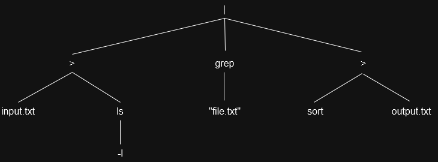

# Parser

## Input

```c
Token(type=COMMAND, value="ls")
Token(type=ARGUMENT, value="-l")
Token(type=REDIRECTION, value="<")
Token(type=FILE, value="input.txt")
Token(type=REDIRECTION, value="|")
Token(type=COMMAND, value="grep")
Token(type=ARGUMENT, value="file.txt")
Token(type=REDIRECTION, value="|")
Token(type=COMMAND, value="sort")
Token(type=REDIRECTION, value=">")
Token(type=FILE, value="output.txt")
```

## Output


